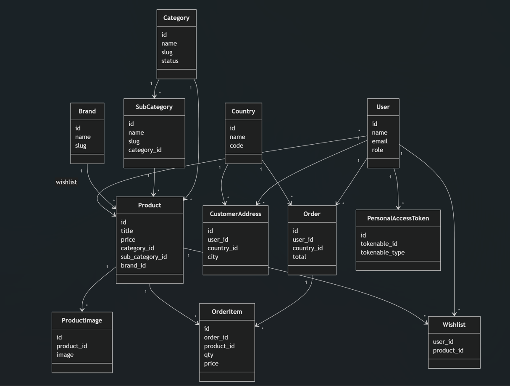

# 🎁 Laravel Gift Shop

A complete **e-commerce web application** built using **Laravel 10**, where customers can buy gifts online and administrators can manage the entire store through a secure admin panel.

---


## 🎥 Project Demo Video
▶️ Watch the full project explanation and demo here:  
[https://youtu.be/project-video-link](https://youtu.be/ypnMgx07rOE?si=tM29KVE_53FugVr1)

---

## 🧩 System Design Diagram
<p align="center">
  
</p>

---
## 🚀 Project Overview

This project consists of two main parts:

- **Customer Side** – Browse products, add to cart, checkout, and view orders  
- **Admin Panel** – Manage products, orders, users, payments, and content  

The system follows **Laravel MVC architecture** and focuses on security, usability, and scalability.

---

## 👤 Customer Features

- User registration, login, and password reset  
- Browse products by category, sub-category, and brand  
- Search, filter, and sort products  
- Product details with multiple images  
- Shopping cart and wishlist  
- Secure checkout using Stripe payment gateway  
- Order history with PDF invoice download  
- Profile and shipping address management  

---

## 🛠️ Admin Panel Features

- Secure admin authentication (separate guard)  
- Dashboard with orders, products, customers, and revenue  
- Product management (add, edit, delete, images, stock)  
- Category and sub-category management  
- Brand management  
- Order management with status updates and invoice emails  
- Customer management  
- Shipping and static page management  
- Admin user management  

---

## 🔐 Technical Highlights

- Laravel 10 (MVC architecture)  
- Stripe payment integration  
- Authentication guards for admin and customers  
- Email system for orders and password reset  
- PDF invoice generation  
- CSRF protection and password hashing  

---

## 🧰 Technology Stack

- **Backend:** Laravel 10  
- **Frontend:** HTML, CSS, JavaScript, Bootstrap  
- **Database:** MySQL  
- **Payment Gateway:** Stripe  
- **PDF Generation:** DomPDF  

---

## ⚙️ Installation

```bash
git clone https://github.com/ProvaPaul/Gift-Shop-Laravel10.git
cd Gift-Shop-Laravel10
composer install
cp .env.example .env
php artisan key:generate
php artisan migrate
php artisan serve
